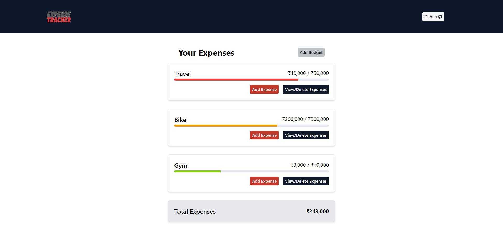
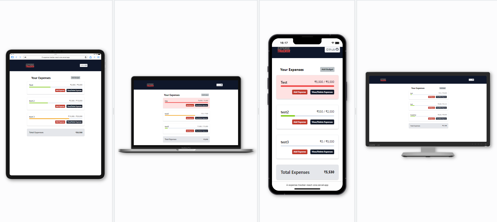

# Expense/Money Tracker with React

## Task

- The Expense Tracker React application
- Task was to contain two input fields that will contain the expense cause or the name of the expense and amount of that expense. It will also going to show the total amount of all expenses below a list of individual expenses.

---

## Learnings

- Learned about the implementation of context API
- Learned how to make custom hooks
- Learned about the useRef()
- Learned how to make custom modal in tailwind CSS
- Learned how to format currency

---

## ScreenShots

## Time Taken

---

- 2 Days taken for this to make

---

## Live Link

- [Link](https://expense-tracker-react-one.vercel.app/)

---

## Tech used

---

- ReactJs
- HTML& TailwindCSS + TailwindCSS Components
- React-icons
- react-hot-toast
